<!--
  เนื้อหานี้ได้จาก "https://medium.com/@ashk3l/a-visual-introduction-to-git-9fdca5d3b43a" ซึ่งเป็นบทความต้นฉบับโดย Ashley Keller
-->

- [Git คืออะไร และใช้ยังไง](#git-คืออะไร-และใช้ยังไง)
  - [เรื่องมันเริ่มต้นเมื่อคุณต้องการแบ่งปันโค้ด](#เรื่องมันเริ่มต้นเมื่อคุณต้องการแบ่งปันโค้ด)
  - [Git คืออะไร](#git-คืออะไร)
  - [เริ่มจากง่าย ๆ ก่อน](#เริ่มจากง่าย-ๆ-ก่อน)
    - [ขั้นที่ 1: แก้ไขไฟล์](#ขั้นที่-1-แก้ไขไฟล์)
    - [ขั้นที่ 2: รวบรวมการเปลี่ยนแปลง](#ขั้นที่-2-รวบรวมการเปลี่ยนแปลง)
    - [ขั้นที่ 3: ปิดกล่อง commit ของคุณ](#ขั้นที่-3-ปิดกล่อง-commit-ของคุณ)
    - [จนถึงขั้นนี้ ทุกอย่างที่ทำมายังอยู่ในเครื่องของคุณเอง](#จนถึงขั้นนี้-ทุกอย่างที่ทำมายังอยู่ในเครื่องของคุณเอง)
    - [ขั้นที่ 4: ส่งออกการเปลี่ยนแปลงของคุณไปยัง GitHub](#ขั้นที่-4-ส่งออกการเปลี่ยนแปลงของคุณไปยัง-github)
    - [ขั้นที่ 5: วนซ้ำไปเรื่อย ๆ](#ขั้นที่-5-วนซ้ำไปเรื่อย-ๆ)
    - [ขั้นที่ 6: เอาการเปลี่ยนแปลงจากผู้พัฒนาอื่น ๆ มาใส่ในโค้ดของคุณ](#ขั้นที่-6-เอาการเปลี่ยนแปลงจากผู้พัฒนาอื่น-ๆ-มาใส่ในโค้ดของคุณ)
  - [หมดแล้ว](#หมดแล้ว)

# Git คืออะไร และใช้ยังไง
> บทความนี้แปลจากบทความเดิมของ Ashley Keller (@ashk3l) ชื่อ [A Visual Introduction to Git](https://medium.com/@ashk3l/a-visual-introduction-to-git-9fdca5d3b43a) บน Medium

แน่นอนว่าการที่คุณมาอ่านคู่มือนี้ คุณก็น่าจะกำลังสนใจว่า Git คืออะไร แล้วมันไว้ใช้ทำอะไร หรือแม้แต่เคยใช้มาบ้างแล้ว แต่ยังงง ๆ ว่าอะไรใช้ยังไงจะถูก ถ้าเป็นแบบนี้ คุณก็มาถูกที่แล้ว ในบทความนี้ เราจะมาเรียนรู้ว่า Git คืออะไร และมันใช้ยังไง โดยเราจะมาเรียนรู้จากแง่มุมของการทำงานของ Git ซึ่งเป็นเครื่องมือที่ช่วยให้เราจัดการกับไฟล์ โดยเฉพาะเรื่องการเก็บประวัติการแก้ไขไฟล์ และการทำงานร่วมกันกับผู้อื่นกัน

## เรื่องมันเริ่มต้นเมื่อคุณต้องการแบ่งปันโค้ด
ผู้เขียนนึกถึงเมื่อตอนที่มองหาบทความอธิบายเกี่ยวกับ Git แบบง่าย ๆ ซึ่งมักจะเต็มไปด้วยรายละเอียด มีลูกศรชี้ไปชี้มา ดูแล้วคงจะสร้างมาเพื่อให้คนที่คุ้นเคยกับทฤษฎีการเขียนโปรแกรมมาก่อนแน่ ๆ บทความนี้จึงถูกเขียนขึ้นเพื่อทำให้เห็นภาพว่าโดยปกติแล้วมอง Git เป็นยังไง แต่ถ้าอยากได้รายละเอียดทางเทคนิคเปะ ๆ ลองอ่าน[ที่นี่](https://help.github.com/articles/set-up-git/) เอา ในนั้นจะมีรายละเอียดทั้งหมดทั้งยิบทั้งย่อยที่น่าจะทำให้คุณทำงานกับ Git ได้ดีขึ้น

## Git คืออะไร
Git เป็นระบบควบคุมรุ่นซอร์ส (Source Control System; SVC) 
ที่ฟรีและเปิดโอเพนซอร์ส เอาง่าย ๆ คืออมันช่วยจัดการการเปลี่ยนแปลง
ในโค้ดโครงการของเราโดยที่ไม่ต้องเขียนไฟล์ใหม่ทั้งหมด นอกจากจะมีประโยชน์กับทีมใหญ่ ๆ ในโปรเจคใหญ่ ๆ แล้ว คนอย่างเรา ๆ ในงานเล็ก ๆ ก็ใช้ได้เหมือนกัน 

หัวใจหลักของกิตจริง ๆ ก็คือเป็นชุดของโน๊ตในโปรเจคของเรา ลองนึกภาพโน๊ต
เป็นปึก ๆ ที่เขียนว่าแต่ละรุ่นของโค้ดเปลี่ยนแปลงเทียบกับอันก่อนหน้าเปลี่ยนไปยังไงบ้าง และในนั้นจะมีคำอธิบายสั้น ๆ เขียนโดยคนเขียนโค้ดว่าทำอะไรไป

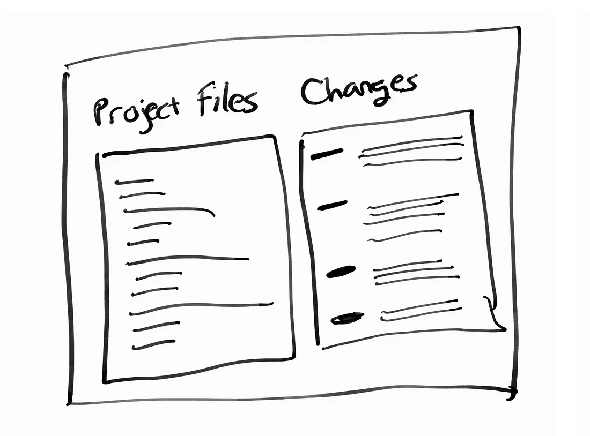

ผู้อ่านเคยเขียนโค้ดในไฟล์เดียวกันกับคนอื่นหรือยัง หรือเคยคิดว่า "ถ้าย้อนไปอันก่อนหน้าได้คงจะดี" หรือสงสัยไหมว่านักพัฒนาเค้าแก้ไขโค้ดกันยังไง นี่คือสิ่งที่ Git ช่วยคุณได้

## เริ่มจากง่าย ๆ ก่อน

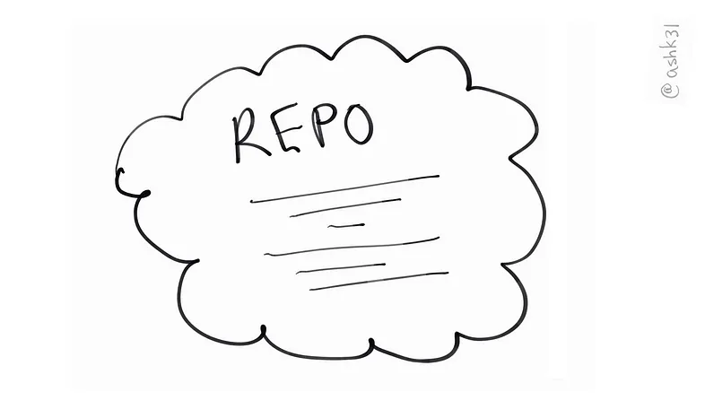

คู่มือนี้ใช้มุมมองของคน ๆ นึงที่เพิ่งจะโหลดไฟล์ Repository จากที่เก็บซอร์สโค้ดสักที่อย่าง [GitHub](https://github.com/) Repository คือชื่อเรียกเจ๋ง ๆ ของโฟลเดอร์หรือที่เก็บไฟล์ที่โครงการของคุณอยู่ก็เท่านั้นเอง

### ขั้นที่ 1: แก้ไขไฟล์
สมมติว่าคุณเพิ่งจะแก้ไขโค้ดไฟล์ HTML กับ CSS อย่างละหน่อย ในบทความนี้เพื่อความสะดวกจะใช้ *style.css* สำหรับไฟล์สไตล์ และ *navigation.hbs* สำหรับไฟล์ HTML

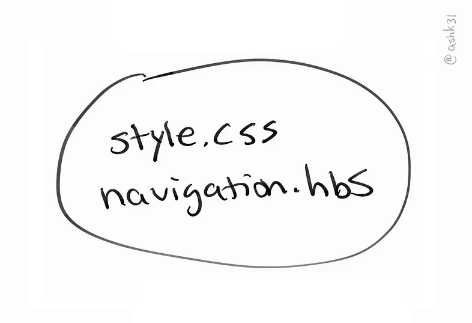

เมื่อใช้งาน Git จะดีมากถ้าทำงานทีละเล็กละน้อยเป็นงาน ๆ ไป แทนที่จะทำหลาย ๆ อย่างในทีเดียว ลองพักสักแปปถ้าเขียนเซ็ตนึงเสร็จแล้ว

ตัวอย่างเช่น ในกรณีนี้คุณแก้ไขเพิ่มเติมปุ่มและเพิ่มสไตล์ให้ปุ่มด้วย พอเสร็จแล้ว มาเริ่ม "ติดตาม" (track) การเปลี่ยนแปลงกันเถอะ

### ขั้นที่ 2: รวบรวมการเปลี่ยนแปลง

นี่คือตอนที่คำสั่งแรกของเราจะเข้ามามีส่วนร่วมแล้ว คำสั่งนี้คือ `git add` เราจะเพิ่มการเปลี่ยนแปลงเข้าไปในในสิ่งที่เรียกว่า *commit* แล้วก็ค่อนข้างคล้ายกับการพูดว่า "นี่คือการเปลี่ยนแปลงที่ฉันเขียน" ฉันชอบนึกภาพว่าเหมือนเอาการเปลี่ยนแปลงใส่ลงไปในกล่องที่เปิดรออยู่

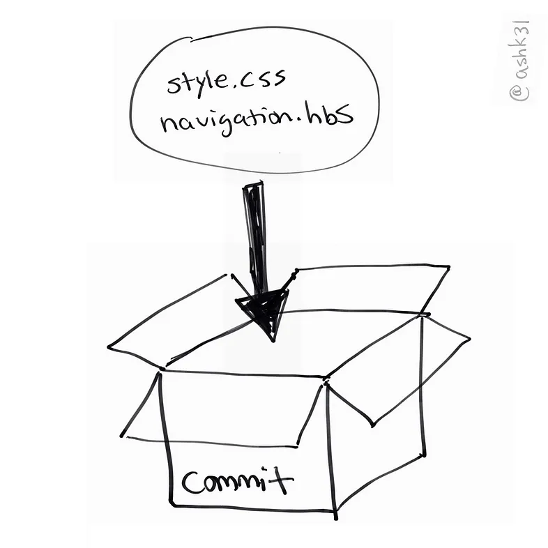

<small>การใช้งาน Git add เหมือนการใส่การแก้ไขลงไปในกล่องพัสดุ</small>

### ขั้นที่ 3: ปิดกล่อง commit ของคุณ
ทีนี้คุณก็ได้ใส่การเปลี่ยนแปลงลงในกล่องแล้ว เราต้องปิดกล่องนี้ก่อนจะส่งออกไป ซึ่งเราจะทำได้โดยการใช้คำสั่ง `git commit` ซึ่งจะเป็นการบอก Git ว่าเราจะส่งออกการเปลี่ยนแปลงที่เราเพิ่มไปในกล่องนี้

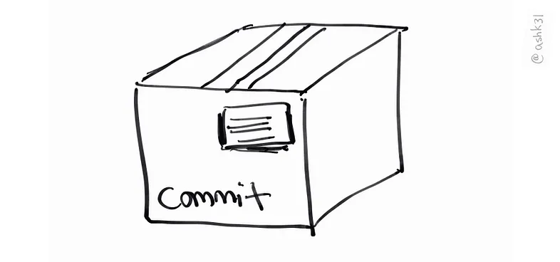

ทีนี้การเปลี่ยนแปลงในไฟล์ก็ถูกเก็บใส่กล่อง แต่เรายังต้องอธิบายด้วยว่าทำไมถึงต้องมีการแก้ไขนี้</ห>

วิธีในการมองการใช้คำสั่ง commit คือการเพิ่มจ่าหน้าให้กล่องเราที่อธิบายว่าอะไรอยู่ในกล่อง (ซึ่งก็คือการแก้ไขโค้ดของเรานั่นแหละ) เมื่อตอนใช้ `git commit` เมื่อใช้คำสั่งแล้ว คุณจะสามารถเพิ่มคำอธิบายสั้น ๆ เปรียบเสมือนกับการเขียนจ่าหน้าให้กับกล่องของคุณได้

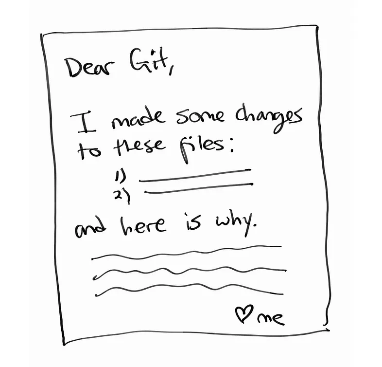

**หมายเหตุ:** คุณสามารถสร้าง commit ที่มีไฟล์เดียวหรือหลายสิบไฟล์ก็ได้ตราบใดที่มีเหตุผลรองรับ แต่แนวทางที่ดีที่สุดคือต้องแบ่งเป็นคอมมิตย่อย ๆ หลาย ๆ คอมมิต แทนที่จะทำทีละเยอะ ๆ แล้วค่อย ๆ ส่งออกไป

เมื่อจัดการสร้าง commit เรียบร้อยเป็นประวัติดีแล้ว นอกจากนั้นยังได้รหัสระบุเฉพาะสำหรับการเปลี่ยนแปลงด้วย พอคุณมีการแก้ไขอะไรเพิ่มเติม ก็สามารถทำเหมือนเดิมได้เลย

### จนถึงขั้นนี้ ทุกอย่างที่ทำมายังอยู่ในเครื่องของคุณเอง

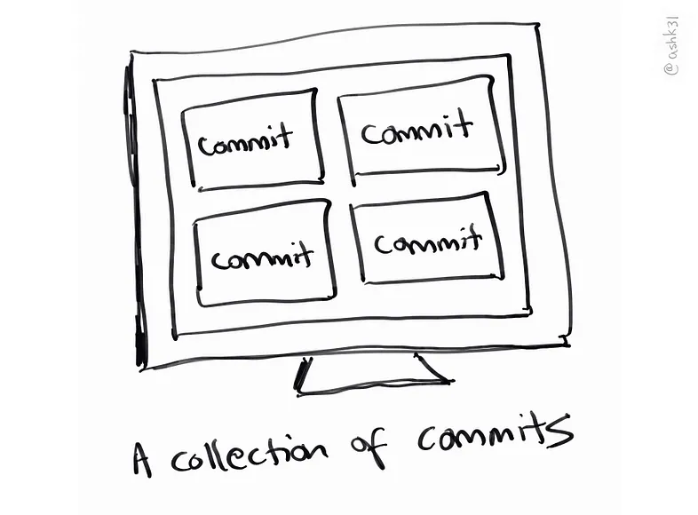

จำเป็นมากที่ต้องบอกคุณว่า**ตอนนี้ที่เราทำมายังอยู่แค่ในเครื่องของคุณ**

กล่องที่เราสร้างขึ้นยังรวมกอง ๆ อยู่ในเครื่องของคุณเอง แต่ยังไม่ได้ส่งออกไปยัง GitHub หรืออื่น ๆ เลย เราต้องส่งโค้ดไปที่ที่เรียกว่า *project repository* ซึ่งเป็นหนึ่งในข้อดี Git ถ้าเทียบกับระบบอื่น ๆ อย่าง SVN แทนที่จะต้องมีการเชื่อมต่อกับเซอร์เวอร์ไฟล์อยู่เสมอเหมือน SVN

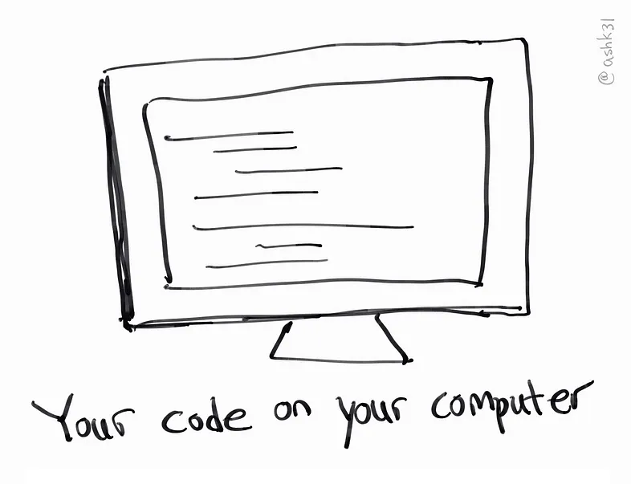

Git สามารถใช้ในเครื่องของคุณเองและไม่ต้องเชื่อมเน็ต แต่ก็ยังใช้งานระบบนี้ได้เหมือนเดิม

### ขั้นที่ 4: ส่งออกการเปลี่ยนแปลงของคุณไปยัง GitHub

เมื่อเรามี commit พร้อมแล้วสำหรับการแชร์กับ Project repository เราสามารถใช้ `git push` โดยสมมติว่าเหมือนกับการใส่กล่องในรถบันทุกขนส่งแล้วส่งออกไป กล่องแต่ละใบยังแยกกันเหมือนเดิมแหละ แต่แค่ส่งพร้อมกัน

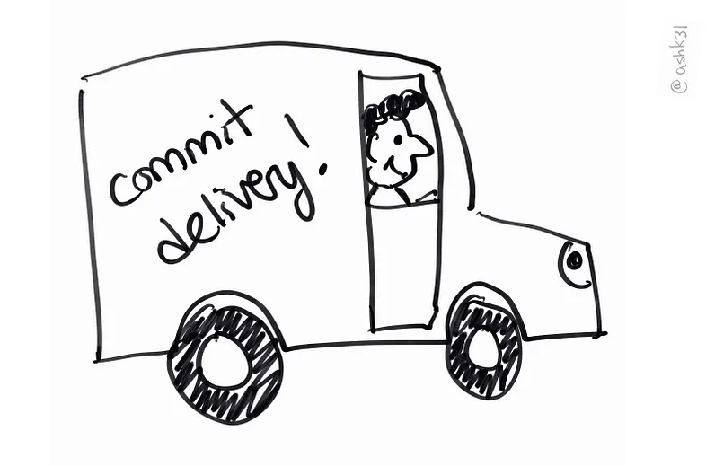

ปี๊ป ๆ รถส่งของจ้า~~ commit ร้อน ๆ มาจ้า

**หมายเหตุ:** ก่อนจะส่ง commit ของคุณไป คุณยังสามารถทำการ "amend" ได้ ซึ่งคือการเพิ่มเติมหรือแก้ไข commit ที่คุณสร้างไว้ก่อนหน้านี้ โดยการใช้ `git commit --amend` และแก้ใบปะหน้าได้ แต่ถ้าส่งไปแล้ว การแก้ไขอาจจะยากขึ้นสักหน่อย

### ขั้นที่ 5: วนซ้ำไปเรื่อย ๆ

เย้ การแก้ไขของคุณถูกนำใส่กลอ่งและส่งไป repository เรียบร้อยแล้ว บางทีก็เรียกว่า repo คนอื่นในทีมหรือคนอื่น ๆ ก็สามารถขอกล่องพวกนี้ไปดูและปรับโค้ดตัวเองให้ตรงกันได้ พวกเค้าก็จะสามารถเอากล่องส่งไปได้เช่นกัน

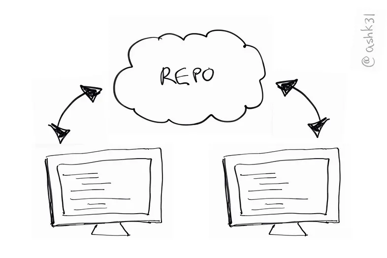

ขอแบบไหนน่ะหรอ นั่นคือสิ่งสุดท้ายที่เราจะพูดถึงในบทนี้

### ขั้นที่ 6: เอาการเปลี่ยนแปลงจากผู้พัฒนาอื่น ๆ มาใส่ในโค้ดของคุณ

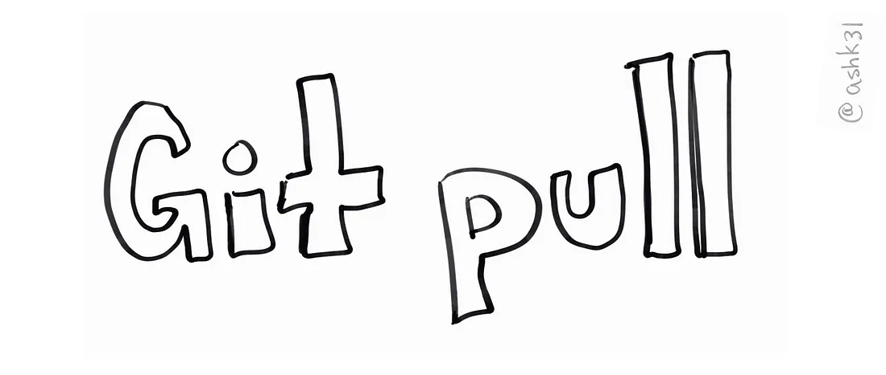

คำสั่ง `git pull` คือการส่งคำของมายัง repository ของคุณ และเอากล่องที่มีการเปลี่ยนแปลงมาใส่ในโค้ดของคุณ และเอากล่องที่เหลือไปใส่ใน repository ของคุณเอง ซึ่งการทำงานนี้ไม่ได้เป็นอัตโนม้ติ ไม่งั้นคงเละเทะแย่

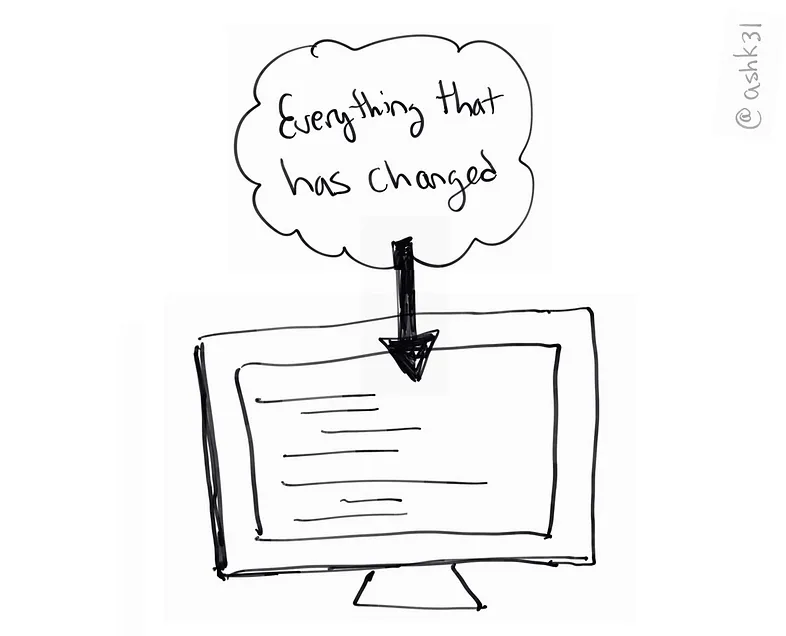

ทำการดึง repository ก็เหมือนการดูการเปลี่ยนแปลงล่าสุดทั้งหมดแล้วเอามาใส่ในโค้ดของคุณเพื่อให้เป็นปัจจุบัน

ปกติก่อนทำอะไรก็ต้อง pull ลงมาก่อน เพื่อให้มั่นใจว่าจะไม่แก้ไขชนกัน แต่ถ้าชนกันจริง ๆ git จะแจ้งคุณเพื่อให้คุณแก้ไขให้เรียบร้อยก่อนที่จะส่งกล่องออกไป เรียกว่า "merge conflict" นะ รายละเอียดเพิ่มเติมในการแก้ดูได้ที่ [การแก้ไข Merge Conflict](https://help.github.com/articles/resolving-a-merge-conflict-using-the-command-line/)

## หมดแล้ว

ยังหรอก บทความนี้แค่พามองผ่าน ๆ ว่าคุณสามารถทำอะไรได้บ้างกับ Git หวังว่าจะช่วยให้เห็นแนวมากขึ้นว่าเทคโนโลยี้นี้ทำงานยังไง หวังว่าอนาคตคุณจะอ่าน[คู่มือแบบเต็ม](https://help.github.com/) เพื่อให้คุ้นเคยและคล่องมากขึ้น

หวังว่าคู่มือนี้จะเป็นประโยชน์ ถ้าคุณแก้ไขได้และเห็นว่าต้องแก้่ ส่ง pull request มาให้เราด้วยนะครับ จะรอดูนะะ
